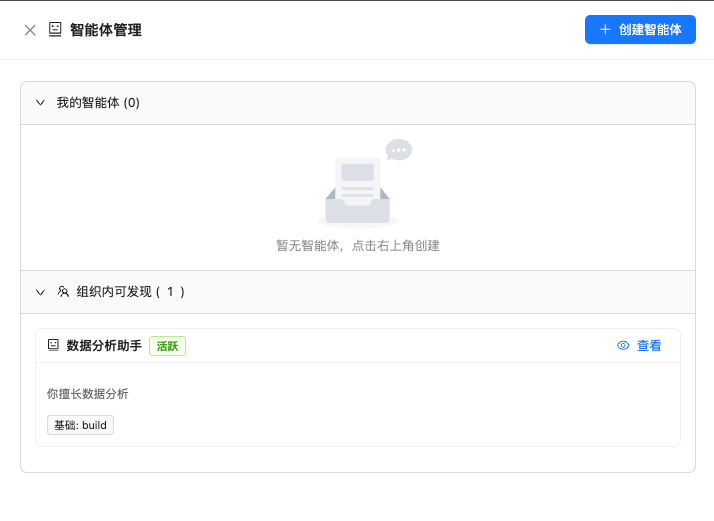
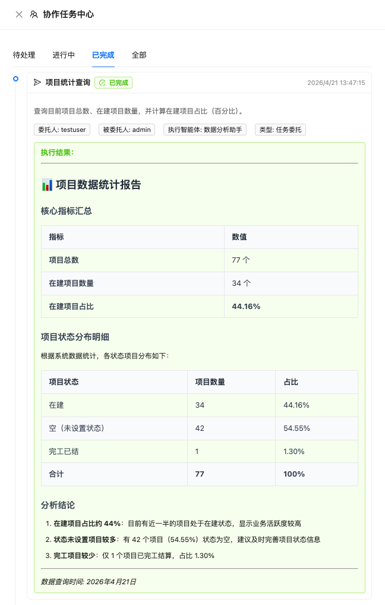
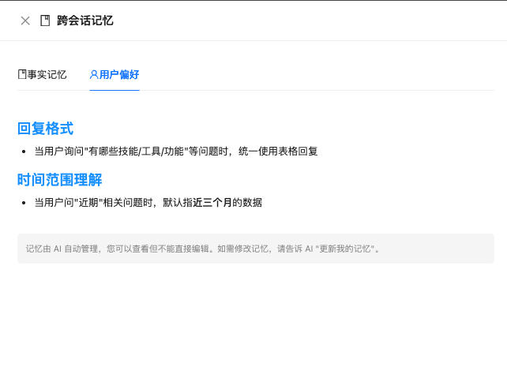

**[中文](README_CN.md)** | English

# OpenHub

> An enterprise-grade multi-user AI platform built on [opencode](https://opencode.ai). One opencode instance, isolated workspaces, persistent memory, and full version control — for every user.

[](https://www.python.org/downloads/)
[](https://nodejs.org/)
[](https://fastapi.tiangolo.com/)
[](https://reactjs.org/)
[](https://opencode.ai)

---

## Highlights

**Multi-user Architecture** — A single `opencode serve` instance serves all users. Each user gets an isolated workspace directory, injected via `?directory=` per session. Independent skills, tools, model permissions, and usage limits per user.

**Cross-session Memory** — The AI remembers. It auto-saves project facts and user preferences to Markdown files in the workspace. On every new conversation, memory context is silently injected into the prompt — no repeated instructions needed.

**Git Time Machine** — Every workspace is a git repo. Each conversation turn auto-commits a snapshot. Users can browse changes, view diffs, and undo any modification with one click. Current state is always auto-saved before undo.

**Scheduled Tasks** — Create cron-based tasks via chat or UI. The AI sets up the schedule, executes tasks on time, and notifies users of results. Supports edit, pause, resume, and manual trigger.

**Smart Entity Collaboration** — Create AI agents (smart entities) with specific capabilities and collaboration configs. Delegate complex tasks between entities via natural language. Auto-accept tasks, track execution status, and view formatted results in the Task Center. Supports entity discovery, task lifecycle management (pending → processing → completed), and role-based permissions (delegator / delegatee / executor).

---

## Architecture

```
 Frontend (:3000)  ──▶  Backend (:8000)  ──▶  opencode serve (:4096)
                                              ┌──── ?directory= ────┐
                                              │                      │
                                     workspace/admin/       workspace/alice/
                                     ├── .opencode/         ├── .opencode/
                                     │   ├── skills/        │   ├── skills/
                                     │   └── tools/         │   └── tools/
                                     ├── MEMORY.md          ├── MEMORY.md
                                     ├── USER.md            ├── USER.md
                                     └── (git repo)         └── (git repo)

 MySQL ─ users · sessions · messages · permissions · usage · git_snapshots · tasks
```

Key design: backend proxies all requests through one opencode instance, using `?directory={workspace_path}` to isolate users. Each workspace has its own skills, tools, memory files, and git history.

Plus: model failover chains, scheduled tasks (cron), smart entity collaboration, SSE streaming, tool permissions, file browser, mobile-responsive UI, 24+ modular skills.

---

## Cross-session Memory

```
 User chats → AI decides info is worth remembering
                      ↓
               memory_save tool (opencode custom tool)
                      ↓
          Writes to workspace MEMORY.md or USER.md
                      ↓
    build_memory_context() on next prompt reads the files
                      ↓
          Memory context silently prepended to user's question
```

| File | Type | What the AI remembers |
|------|------|-----------------------|
| `MEMORY.md` | Facts | Project background, work progress, technical decisions, codebase structure |
| `USER.md` | Preferences | Communication style, language, workflow habits |

- **Storage**: plain Markdown in user workspace — git-friendly, human-readable
- **Write**: AI calls `memory_save` via opencode custom tool (`.opencode/tools/memory.ts`)
- **Read**: auto-injected into every prompt via `build_memory_context()` (max 2000 chars)
- **Scheduled tasks**: memory context also injected into task prompts
- **Frontend**: read-only viewer (Drawer), admin can enable/disable per user

---

## Git Time Machine

```
 Conversation turn completes
         ↓
 Auto git add + commit (only if files changed)
         ↓
 git_snapshots table records hash, session, diff summary
         ↓
 User opens Time Machine → browses snapshots, views diffs
         ↓
 Click "Undo this change" → git checkout {hash}^ → files revert
         ↓
 Auto-save commit created (current state preserved)
```

- Every workspace is auto-initialized as a git repo on creation
- Snapshots are taken after each conversation turn and scheduled task
- **"Undo" reverts to parent commit** — the workspace goes back to the state before that change was made
- First commit (workspace init) cannot be undone — button is disabled in UI
- Supports undo all files or a single file
- Undo always auto-saves current state first (no data loss)

---

## Smart Entity Collaboration

```
 User creates a smart entity (agent) with name, description, and capabilities
                    ↓
 Entity registers with collaboration config (auto-accept, timeout, permissions)
                    ↓
 User delegates task via chat: "Ask agent001 to analyze 2025 revenue"
                    ↓
 smart_entity_delegate tool creates task → stored in MySQL
                    ↓
 Auto-accept? → Spawn session in target workspace → Execute with entity's context
                    ↓
 Poll session every 30s until finish=stop → Save result
                    ↓
 Task Center shows: delegator / delegatee / executor / result with markdown
```

| Field | Description |
|-------|-------------|
| **Delegator** | User who creates and sends the task |
| **Delegatee** | User who receives the task (owner of target entity) |
| **Executor** | Smart entity that actually performs the work |
| **Status** | pending → accepted → processing → completed / failed |

- Entities can auto-accept tasks based on collaboration config
- Task execution spawns isolated session with entity's memory context
- Results formatted with markdown tables, support GFM syntax
- Full task lifecycle visible in Task Center UI with role-based filtering

---

## Quick Start

```bash
# 1. Clone and configure
git clone <repo-url> && cd OpenHub
cp smart-query-backend/.env.example smart-query-backend/.env   # MySQL creds, JWT secret
cp smart-query-frontend/.env.example smart-query-frontend/.env

# 2. Install dependencies
cd smart-query-backend && pip install -r requirements.txt
cd ../smart-query-frontend && npm install

# 3. Initialize database
cd ../smart-query-backend && python init_db.py

# 4. Start
python -m uvicorn app.main:app --host 0.0.0.0 --port 8000   # Backend (auto-starts opencode)
cd ../smart-query-frontend && npm run dev                      # Frontend
```

Access: **Frontend** http://localhost:3000 · **API Docs** http://localhost:8000/docs

Prerequisites: Python 3.10+, Node.js 18+, MySQL 5.7+, [opencode](https://opencode.ai) 1.4+

---

## Screenshots

| Chat Interface | File Management | Admin Panel |
|:-:|:-:|:-:|
|  |  |  |

| Tool Permissions | Usage Statistics | Model Settings |
|:-:|:-:|:-:|
|  |  |  |

| Smart Entity Management | Collaboration Tasks | Cross-session Memory |
|:-:|:-:|:-:|
|  |  |  |

---

## Project Structure

```
OpenHub/
├── .opencode/
│   ├── skills/                    # 24 skill packages (template source)
│   └── tools/
│       ├── memory.ts              # Cross-session memory tool
│       └── scheduled-task.ts      # Scheduled task tool
├── smart-query-backend/           # FastAPI backend
│   ├── app/
│   │   ├── api/                   # auth, query, admin, session, internal
│   │   ├── services/              # stream, memory, git_snapshot, failover, scheduler
│   │   └── core/                  # JWT auth
│   ├── workspace/{username}/      # Per-user workspaces
│   └── init_db.py
├── smart-query-frontend/          # React + Vite + Ant Design
│   └── src/
│       ├── pages/                 # LoginPage, SmartQueryPage, AdminPage
│       ├── components/            # ChatInput, MemoryViewer, GitTimeMachine, ...
│       └── services/api.js
└── AGENTS.md
```

---

## Configuration

**Backend** (`smart-query-backend/.env`):

```bash
DB_HOST=127.0.0.1    DB_USER=root    DB_PASSWORD=***    DB_NAME=ANALYSE
OPENCODE_BASE_URL=http://127.0.0.1:4096
OPENCODE_USERNAME=opencode    OPENCODE_PASSWORD=***
JWT_SECRET_KEY=***
REDIS_HOST=localhost    REDIS_PORT=6379    REDIS_DB=0
INTERNAL_API_SECRET=***    # Required for memory & task tools
```

**Admin Panel** (`/admin`): user CRUD, workspace init, model/tool/skill permissions per user, model failover chains, opencode service management.

---

## Development

```bash
# Backend (auto-reload)
cd smart-query-backend && python -m uvicorn app.main:app --reload --host 0.0.0.0 --port 8000

# Frontend
cd smart-query-frontend && npm run dev      # Dev server
npm run build                               # Production build

# Database migration
python init_db.py
```

---

## License

MIT License
