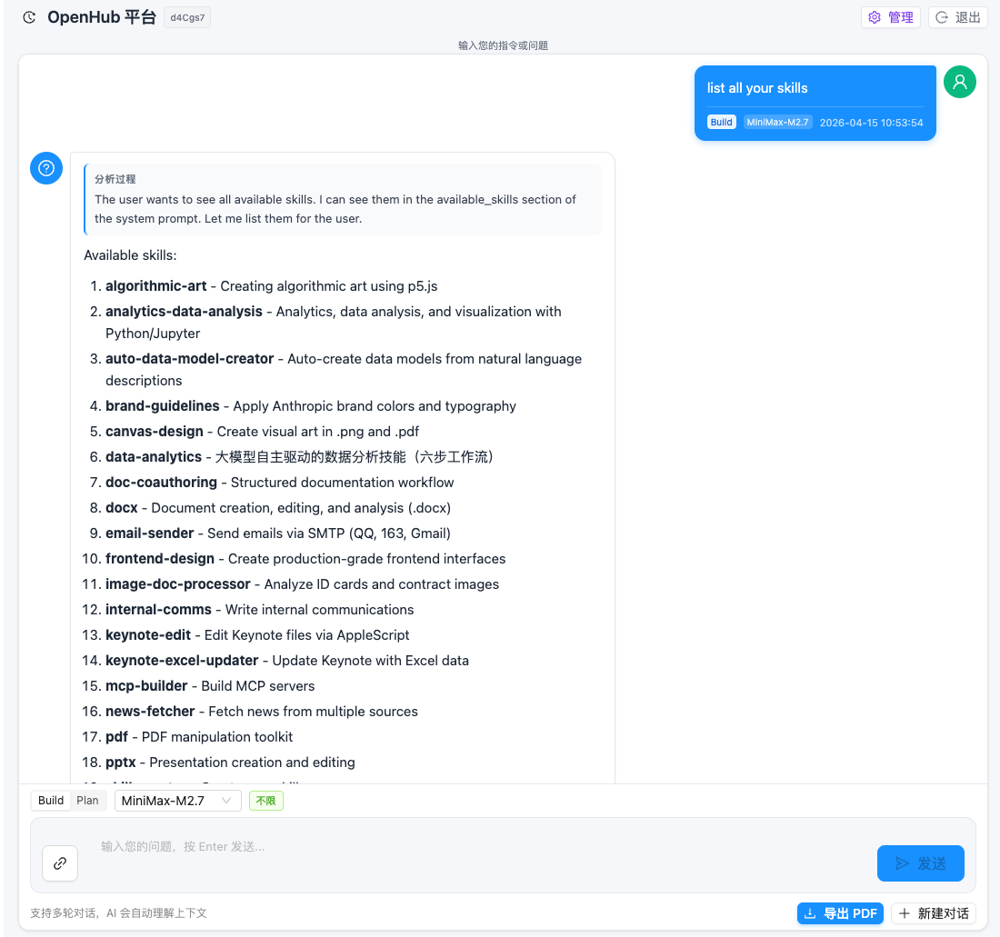
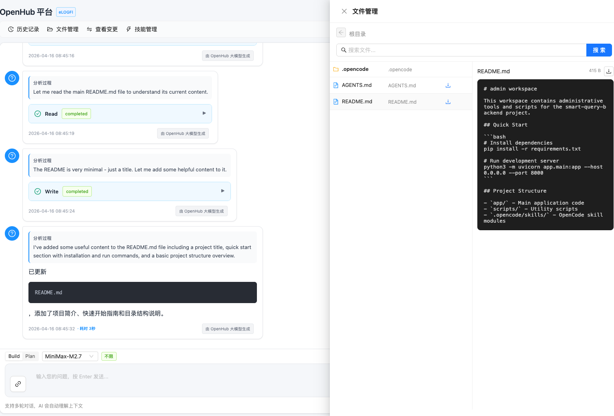
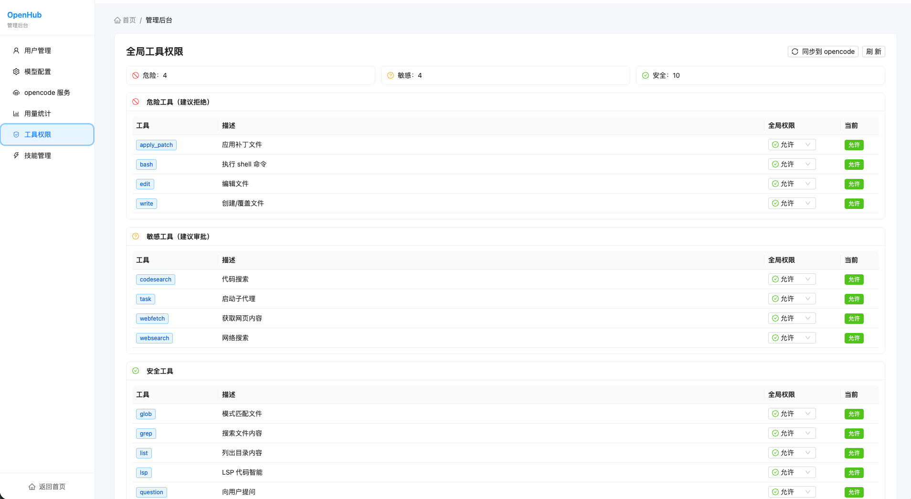
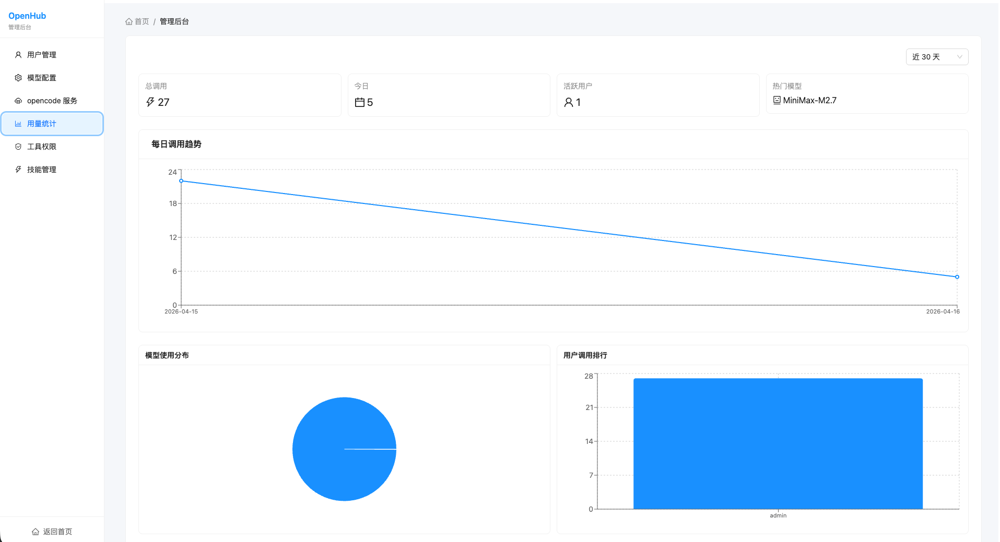
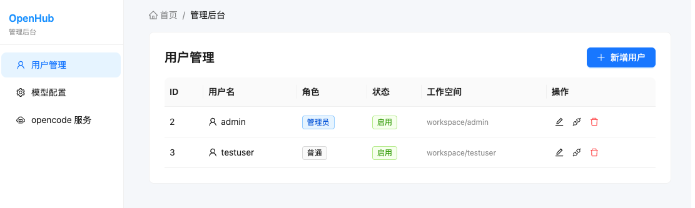
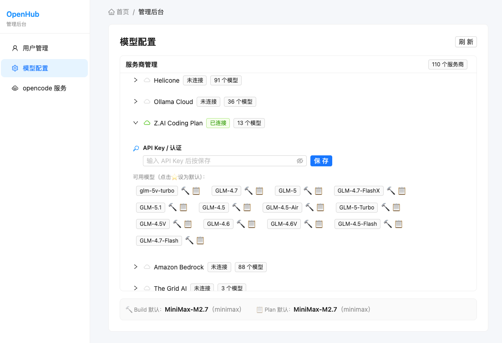
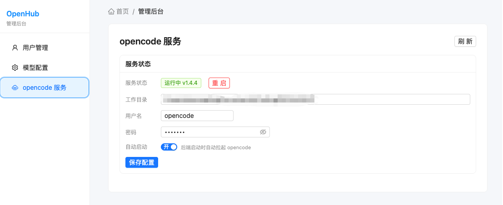
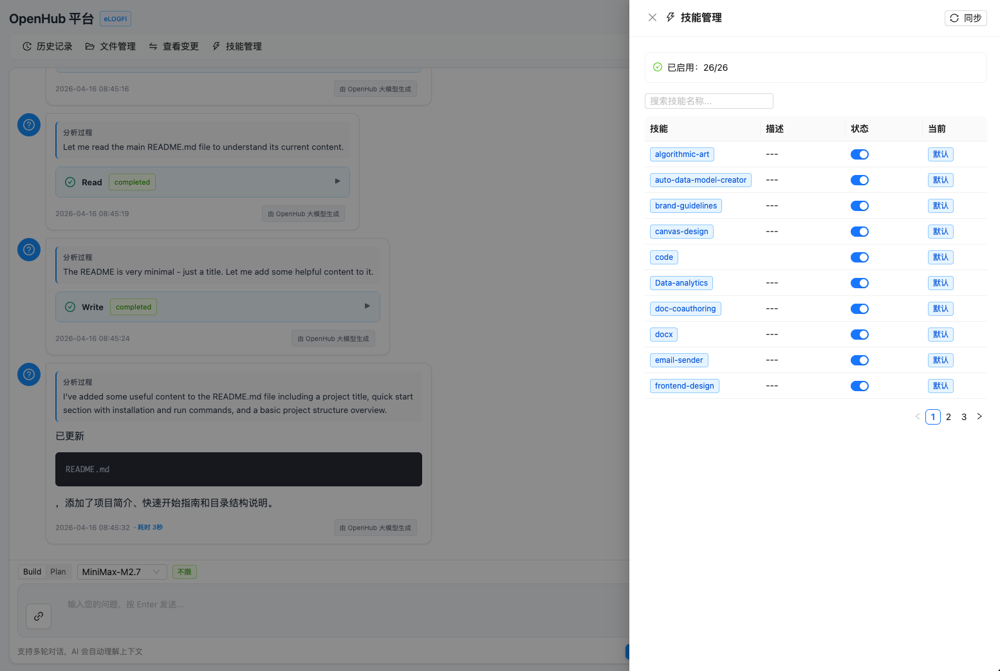

中文 | **[English](README.md)**

# OpenHub

> 基于 [opencode](https://opencode.ai) 构建的企业级多用户 Web 平台，支持用户管理、模型权限控制、独立工作空间和模块化技能包。

[](https://www.python.org/downloads/)
[](https://nodejs.org/)
[](https://fastapi.tiangolo.com/)
[](https://reactjs.org/)
[](https://opencode.ai)

---

## 平台特性

| 特性 | 说明 |
|------|------|
| **多用户管理** | 用户增删改查、角色管理、JWT 认证 |
| **独立工作空间** | 每用户独立工作目录，隔离 `.opencode/skills/` |
| **模型权限控制** | 按用户配置可用模型，支持月调用次数限制 |
| **服务商管理** | 通过管理后台配置 AI 服务商 API Key、默认模型 |
| **opencode 服务控制** | 管理面板中启动/停止/重启 opencode serve |
| **实时流式响应** | SSE 流式输出，支持工具调用和推理过程展示 |
| **多模态输入** | 支持图片上传分析 |
| **文件管理器** | 浏览、预览、搜索、下载工作空间文件 |
| **工具权限管理** | 按用户配置工具的拒绝/询问/允许权限 |
| **用量统计** | 按模型、用户、时间段可视化 token 消耗和请求数 |
| **定时任务** | 通过 UI 或 AI 对话创建 cron 任务，支持编辑/暂停/恢复 |
| **任务通知** | 实时 SSE 推送任务结果，通知铃铛支持已读/未读页签 |
| **模型兜底** | 可配置每模型的 fallback chain + 全局兜底模型，失败自动切换 |
| **默认模型** | 分别配置 Build、Plan、定时任务的默认模型 |
| **撤销与重试** | 撤销最后一轮对话或用相同 prompt 重试；软删除 + opencode 同步 |
| **移动端适配** | 完整移动端优化 UI，底部面板、触摸友好 |
| **24 个技能包** | PDF、Excel、Word、PPT、邮件、新闻、前端设计等 |

---

## 系统架构

```
┌──────────────────────────────────────────────────────────────────┐
│                       Opencode Agent 平台                         │
├──────────────────────────────────────────────────────────────────┤
│                                                                   │
│  ┌──────────────────┐     ┌──────────────────┐                   │
│  │   React 前端      │────▶│   FastAPI 后端    │                   │
│  │  Vite + Ant Design│◀────│   (SSE 流式响应)   │                   │
│  └──────────────────┘     └────────┬─────────┘                   │
│                                    │                              │
│                           ┌────────▼─────────┐                   │
│                           │  opencode serve    │                   │
│                           │  (:4096, 单实例)   │                   │
│                           └────────┬─────────┘                   │
│                                    │ ?directory=                  │
│                    ┌───────────────┼───────────────┐              │
│                    ▼               ▼               ▼              │
│           ┌──────────────┐ ┌──────────────┐ ┌──────────────┐     │
│           │   workspace/  │ │  workspace/  │ │  workspace/  │     │
│           │    admin/     │ │   testuser/  │ │  newuser/    │     │
│           │ ┌───────────┐│ │ ┌───────────┐│ │ ┌───────────┐│     │
│           │ │ .opencode/ ││ │ │ .opencode/ ││ │ │ .opencode/ ││     │
│           │ │ └─skills/  ││ │ │ └─skills/  ││ │ │ └─skills/  ││     │
│           │ │ AGENTS.md  ││ │ │ AGENTS.md  ││ │ │ AGENTS.md  ││     │
│           │ └───────────┘│ │ └───────────┘│ │ └───────────┘│     │
│           └──────────────┘ └──────────────┘ └──────────────┘     │
│                                                                   │
│  ┌─────────────────────────────────────────────────────────────┐  │
│  │                    MySQL 数据库                              │  │
  │  │  users · sessions · messages · model_permissions · usage         │  │
  │  │  system_config · images · scheduled_tasks · notifications        │  │
  │  │  scheduled_task_runs · model_failover_chains                     │  │
│  └─────────────────────────────────────────────────────────────┘  │
└──────────────────────────────────────────────────────────────────┘
```

### 核心设计

- **单 opencode 实例** 运行在 `:4096`，所有用户共享，通过会话级 `?directory=` 参数隔离用户工作空间
- 每个工作空间拥有自己的 `.opencode/skills/`，不同用户可有不同技能集
- `prompt_async` 和 `global/event` API 均传递 `?directory=`，确保加载正确的项目上下文
- 后端启动时自动拉起 opencode serve（可在管理面板配置）
- **APScheduler** 驱动 cron 定时任务：启动时注册所有启用的任务，创建/更新任务时同步调度器
- 任务执行器通过 SSE 事件收集 AI 响应，自动过滤 reasoning 文本，生成干净的通知预览
- 通知通过进程内异步队列实时推送，无需 Redis（Redis 仅用于 JWT 令牌缓存）
- **模型兜底**在 `prompt_async` 失败时自动按配置的 fallback chain 重试，交互式查询和定时任务均支持
- **撤销/重试**使用软删除（`visible=0`）+ opencode 消息删除，保持上下文同步

---

## 快速开始

### 前置要求

| 组件 | 版本 | 说明 |
|------|------|------|
| Python | 3.10+ | 后端运行时 |
| Node.js | 18+ | 前端构建 |
| MySQL | 5.7+ | 数据库 |
| opencode | 1.4+ | AI Agent 运行时 |

### 1. 克隆与配置

```bash
git clone <repo-url>
cd OpenHub

# 后端配置
cp smart-query-backend/.env.example smart-query-backend/.env
# 编辑 .env 填入 MySQL 凭据、JWT 密钥等

# 前端配置
cp smart-query-frontend/.env.example smart-query-frontend/.env
# 编辑 .env 填入后端 API 地址
```

### 2. 安装依赖

```bash
# 后端
cd smart-query-backend
pip install -r requirements.txt

# 前端
cd ../smart-query-frontend
npm install
```

### 3. 初始化数据库

```bash
cd smart-query-backend
python init_db.py
```

自动创建所有表（`users`、`conversation_sessions`、`conversation_messages`、`conversation_images`、`user_model_permissions`、`system_config`）及默认管理员账号（密码：`admin`，可通过 `ADMIN_PASSWORD` 环境变量配置）。

### 4. 启动服务

```bash
# 终端 1：后端（自动启动 opencode serve）
cd smart-query-backend
python -m uvicorn app.main:app --host 0.0.0.0 --port 8000

# 终端 2：前端
cd smart-query-frontend
npm run dev
```

### 5. 访问

| 服务 | 地址 |
|------|------|
| 前端界面 | http://localhost:3000 |
| 后端 API | http://localhost:8000 |
| API 文档 (Swagger) | http://localhost:8000/docs |
| opencode serve | http://localhost:4096 |

默认管理员账号：`admin` / `admin`

---

## 界面截图

### 💬 对话界面
流畅的聊天体验，支持实时 AI 响应、多模态输入、对话历史、文件管理和技能管理。



### 📁 文件管理
浏览、预览、搜索和下载工作空间文件，支持文本和图片预览，完整移动端适配。



### 🛠️ 工具权限管理
精细化控制每个用户可使用的工具，支持拒绝/询问/允许三种权限级别。



### 📊 用量统计
按模型、用户和时间段可视化 AI 使用量，含图表和可排序表格。



### 👥 用户管理
全面的用户管理面板，支持创建、编辑和管理用户账号，具备基于角色的访问控制。



### 🤖 模型配置
灵活的 AI 模型管理，支持服务商集成、API 密钥配置和默认模型设置。



### ⚙️ 服务设置
Opencode 服务控制面板，用于管理 AI 代理运行时，包括自动启动配置和服务监控。



### 🎯 用户技能管理
按用户启用或禁用模块化技能包，包括 PDF、Excel、Word、PPT、邮件、新闻、前端设计、数据分析等。



---

## 项目结构

```
OpenHub/
├── .opencode/skills/              # 技能包（模板源）
│   ├── data-analytics/            #   数据查询分析
│   ├── pdf/                       #   PDF 处理
│   ├── xlsx/                      #   电子表格
│   ├── docx/                      #   Word 文档
│   ├── pptx/                      #   演示文稿
│   ├── email-sender/              #   邮件发送
│   ├── frontend-design/           #   UI 生成
│   ├── workflow-manager/          #   任务编排
│   └── ...                        #   其余 16 个技能
│
├── smart-query-backend/           # FastAPI 后端
│   ├── app/
│   │   ├── main.py                #   入口 + 生命周期（自动启动 opencode）
│   │   ├── config.py              #   环境配置
│   │   ├── database.py            #   MySQL 操作 + 用户/工作空间 CRUD
│   │   ├── api/
│   │   │   ├── auth.py            #   登录/登出/JWT
│   │   │   ├── query.py           #   查询端点（流式 + 非流式）
│   │   │   ├── admin.py           #   管理后台：用户、模型、opencode 控制
│   │   │   ├── session.py         #   会话 + 任务 + 通知端点
│   │   │   └── internal.py        #   AI 工具调用的内部 API
│   │   ├── services/
  │   │   │   ├── stream.py          #   SSE 事件收集器 + 流生成器
  │   │   │   ├── scheduler.py       #   APScheduler cron 任务调度器
  │   │   │   ├── task_executor.py   #   静默任务执行器（含 SSE reasoning 过滤）
  │   │   │   ├── model_failover.py  #   兜底链构建 + prompt 重试逻辑
  │   │   │   ├── notif_stream.py    #   通知 SSE 推送分发器
│   │   │   ├── opencode_client.py #   opencode HTTP 客户端
│   │   │   └── opencode_launcher.py #  opencode 进程管理
│   │   ├── core/
│   │   │   └── auth.py            #   JWT 令牌创建/验证
│   │   └── models/                #   Pydantic 请求/响应模型
│   ├── workspace/                 #   用户工作空间目录
│   │   └── {username}/            #     创建用户时自动初始化
│   ├── config/                    #   模型配置文件
│   ├── init_db.py                 #   数据库初始化脚本
│   └── requirements.txt
│
 ├── smart-query-frontend/          # React + Vite 前端
│   ├── src/
│   │   ├── App.jsx                #   路由 + 布局
│   │   ├── main.jsx               #   入口点
│   │   ├── pages/
│   │   │   ├── LoginPage.jsx      #     登录页
│   │   │   ├── SmartQueryPage.jsx #     对话界面（主页）
│   │   │   └── AdminPage.jsx      #     管理后台（用户/模型/opencode）
│   │   ├── components/
│   │   │   ├── ChatInput.jsx      #     输入框 + 模型选择器 + 移动端底部面板
│   │   │   ├── FileManager.jsx    #     文件管理器（预览/搜索/下载）
│   │   │   ├── ToolPermissionManager.jsx # 工具权限管理（拒绝/询问/允许）
│   │   │   ├── UsageStats.jsx     #     用量统计图表 + 可排序表格
│   │   │   ├── SkillManager.jsx   #     管理后台技能管理
│   │   │   ├── UserSkillManager.jsx #   用户技能启用/禁用
│   │   │   ├── DiffViewer.jsx     #     文件变更查看
│   │   │   ├── HistoryDrawer.jsx  #     对话历史
  │   │   │   ├── ToolCall.jsx       #     工具调用展示
  │   │   │   ├── AssistantMessage.jsx #  助手消息 + 撤销/重试按钮
  │   │   │   ├── MessageBubble.jsx  #     聊天消息气泡
│   │   │   ├── MarkdownRenderer.jsx #   Markdown + 代码高亮
│   │   │   ├── TaskManager.jsx    #     定时任务管理抽屉（行内编辑）
│   │   │   ├── NotificationBell.jsx #   通知铃铛（已读/未读页签）
│   │   │   ├── TodoFloatPanel.jsx #     AI 任务进度浮动面板
│   │   │   └── TableWithChart.jsx #     图表表格组件
│   │   └── services/
│   │       └── api.js             #     Axios API 客户端 + 服务对象
│   └── package.json
│
 ├── AGENTS.md                      # AI 编码代理开发者指南
├── README.md                      # 英文文档（主版本）
└── README_CN.md                   # 中文文档（本文件）
```

---

## API 接口

### 认证

| 端点 | 方法 | 说明 |
|------|------|------|
| `/api/auth/login` | POST | 登录，返回 JWT 令牌 |
| `/api/auth/logout` | POST | 登出 |
| `/api/auth/me` | GET | 获取当前用户信息 |

### 查询

| 端点 | 方法 | 说明 |
|------|------|------|
| `/api/query/stream` | POST | 流式查询 (SSE)，支持图片 + 模型选择 |
| `/api/query` | POST | 非流式查询 |
| `/api/query/abort` | POST | 终止进行中的查询 |
| `/api/query/stream/reconnect` | GET | 重连活跃的 SSE 流 |

### 会话

| 端点 | 方法 | 说明 |
|------|------|------|
| `/api/sessions` | GET | 会话列表（分页） |
| `/api/sessions/{id}/messages` | GET | 获取会话消息 |
| `/api/sessions/{id}/messages/last-turn` | DELETE | 撤销最后一轮对话（软删除） |
| `/api/sessions/{id}/retry` | POST | 重试最后一轮（删除助手消息，重新 prompt） |
| `/api/session/archive` | POST | 归档会话 |
| `/api/images/{image_id}` | GET | 获取上传的图片 |

### 文件

| 端点 | 方法 | 说明 |
|------|------|------|
| `/api/files` | GET | 列出工作空间文件（分页） |
| `/api/files/content` | GET | 获取文件内容用于预览 |
| `/api/files/search` | GET | 按文件名模式搜索文件 |
| `/api/files/download` | GET | 下载文件 |

### 技能（用户）

| 端点 | 方法 | 说明 |
|------|------|------|
| `/api/skills` | GET | 获取可用技能列表 |
| `/api/skills/{skill_name}` | PUT | 启用/禁用技能 |
| `/api/skills/sync` | POST | 从工作空间同步技能 |

### 定时任务（用户）

| 端点 | 方法 | 说明 |
|------|------|------|
| `/api/tasks` | GET | 获取当前用户的定时任务列表 |
| `/api/tasks/{id}` | PUT | 更新任务（名称、问题、cron 表达式） |
| `/api/tasks/{id}/toggle` | POST | 开启或暂停任务 |
| `/api/tasks/{id}/run` | POST | 手动触发任务执行 |

### 通知

| 端点 | 方法 | 说明 |
|------|------|------|
| `/api/notifications` | GET | 获取通知列表（支持 `?unread=true`） |
| `/api/notifications/{id}/read` | POST | 标记通知为已读 |
| `/api/notifications/stream` | GET | SSE 流实时接收通知（需 `?token=`） |

### 管理后台

| 端点 | 方法 | 说明 |
|------|------|------|
| `/api/admin/users` | GET | 用户列表 |
| `/api/admin/users` | POST | 创建用户（自动初始化工作空间） |
| `/api/admin/users/{id}` | PUT | 更新用户 |
| `/api/admin/users/{id}` | DELETE | 删除用户 |
| `/api/admin/users/{id}/init-workspace` | POST | 初始化用户工作空间 |
| `/api/admin/users/{id}/models` | GET/PUT | 用户模型权限 |
| `/api/admin/users/{id}/tools/{tool_name}` | PUT/DELETE | 设置/删除用户工具权限 |
| `/api/admin/users/{id}/skills/{skill_name}` | PUT/DELETE | 设置/删除用户技能 |
| `/api/admin/models` | GET | 可用模型列表 |
| `/api/admin/tools` | GET | 工具列表 |
| `/api/admin/tools/{tool_name}` | PUT | 更新工具配置 |
| `/api/admin/tools/sync` | POST | 从工作空间同步工具 |
| `/api/admin/skills` | GET | 技能列表 |
| `/api/admin/skills/{skill_name}` | PUT | 更新技能配置 |
| `/api/admin/skills/sync` | POST | 从工作空间同步技能 |
| `/api/admin/opencode/providers` | GET | AI 服务商列表 |
| `/api/admin/opencode/provider-auth` | GET | 获取服务商认证信息 |
| `/api/admin/opencode/auth/{provider_id}` | PUT | 更新服务商认证 |
| `/api/admin/opencode/config` | GET/PATCH | 获取/设置 opencode 配置 |
| `/api/admin/opencode/config/providers` | GET | 获取服务商配置 |
| `/api/admin/opencode/status` | GET | opencode 服务状态 |
| `/api/admin/opencode/start` | POST | 启动 opencode |
| `/api/admin/opencode/restart` | POST | 重启 opencode |
| `/api/admin/system-config` | GET/PUT | 系统配置（默认模型等） |
| `/api/admin/failover-chains` | GET | 获取所有模型兜底链 |
| `/api/admin/failover-chains` | PUT | 设置模型的兜底链 |
| `/api/admin/failover-chains/{id}` | DELETE | 删除兜底链规则 |
| `/api/admin/usage/stats` | GET | 用量统计数据 |

### 内部 API

> 需要 `X-Internal-Token` 请求头，仅限 `127.0.0.1` 访问。

| 端点 | 方法 | 说明 |
|------|------|------|
| `/api/internal/tasks` | GET | 获取任务列表（通过 `directory` 查询参数） |
| `/api/internal/tasks` | POST | 创建定时任务 |
| `/api/internal/tasks/{id}` | PUT | 更新任务 |
| `/api/internal/tasks/{id}` | DELETE | 删除任务 |
| `/api/internal/tasks/{id}/pause` | POST | 暂停任务 |
| `/api/internal/tasks/{id}/resume` | POST | 恢复任务 |
| `/api/internal/tasks/{id}/run` | POST | 手动触发任务执行 |

---

## 配置说明

### 后端环境变量 (`smart-query-backend/.env`)

| 变量 | 默认值 | 说明 |
|------|--------|------|
| `DB_HOST` | `127.0.0.1` | MySQL 地址 |
| `DB_USER` | `root` | MySQL 用户 |
| `DB_PASSWORD` | - | MySQL 密码 |
| `DB_NAME` | `ANALYSE` | 数据库名 |
| `OPENCODE_BASE_URL` | `http://127.0.0.1:4096` | opencode 地址 |
| `OPENCODE_USERNAME` | `opencode` | opencode 认证用户名 |
| `OPENCODE_PASSWORD` | - | opencode 认证密码 |
| `JWT_SECRET_KEY` | - | JWT 签名密钥 |
| `REDIS_HOST` | `localhost` | Redis 地址（可选，用于 JWT 令牌缓存） |
| `REDIS_PORT` | `6379` | Redis 端口 |
| `REDIS_DB` | `0` | Redis 数据库编号 |
| `INTERNAL_API_SECRET` | - | 内部 API 调用密钥 |

### 前端环境变量 (`smart-query-frontend/.env`)

| 变量 | 默认值 | 说明 |
|------|--------|------|
| `VITE_API_BASE_URL` | `/api` | 后端 API 地址 |

### 管理后台配置

通过管理面板 (`/admin`) 配置：

- **opencode 服务**：工作目录、认证信息、自动启动开关
- **默认模型**：设置默认 build/plan/定时任务模型
- **模型兜底**：配置每模型的 fallback chain + 全局兜底模型
- **模型权限**：按用户配置可用模型及月调用次数限制
- **服务商 API Key**：管理 AI 服务商凭据

---

## 用户工作空间

每个用户在 `smart-query-backend/workspace/{username}/` 下拥有独立工作空间：

```
workspace/{username}/
├── .opencode/
│   └── skills/           # 用户技能集（创建时从模板复制）
│       ├── pdf/
│       ├── xlsx/
│       └── ...
├── AGENTS.md             # 工作空间的 Agent 指令
└── README.md
```

**工作原理：**

1. 用户发送查询时，后端通过 `POST /session?directory={workspace_path}` 创建会话
2. `prompt_async` 和 `global/event` API 也传递 `?directory=`，确保 opencode 加载正确的项目
3. opencode 通过目录路径识别每个工作空间为独立项目，加载对应的 skills 和配置
4. 修改工作空间的 `.opencode/skills/` 即可为不同用户定制技能集

---

## 开发

### 后端

```bash
cd smart-query-backend

# 开发模式（自动重载）
python -m uvicorn app.main:app --reload --host 0.0.0.0 --port 8000

# 语法检查
python -m py_compile app/api/admin.py

# 代码检查
ruff check app/
ruff format app/
```

### 前端

```bash
cd smart-query-frontend

# 开发
npm run dev

# 生产构建
npm run build
```

### 数据库迁移

```bash
cd smart-query-backend
python init_db.py          # 初始化或更新数据库
```

---

## 故障排查

### opencode 无响应

```bash
# 检查 opencode 状态
curl -u opencode:密码 http://localhost:4096/global/health

# 检查后端健康状态（含 opencode 状态）
curl http://localhost:8000/api/health

# 查看后端日志
tail -f /tmp/backend.log
```

### 工作空间加载错误

- 检查 `workspace/{username}/.opencode/skills/` 是否存在且包含技能
- 确认数据库 `users.workspace_path` 与实际目录一致
- 在管理面板使用"初始化工作空间"按钮

### 前端无法连接后端

```bash
# 检查 .env 配置
cat smart-query-frontend/.env

# 确认后端运行中
curl http://localhost:8000/
```

---

## 许可证

MIT License
