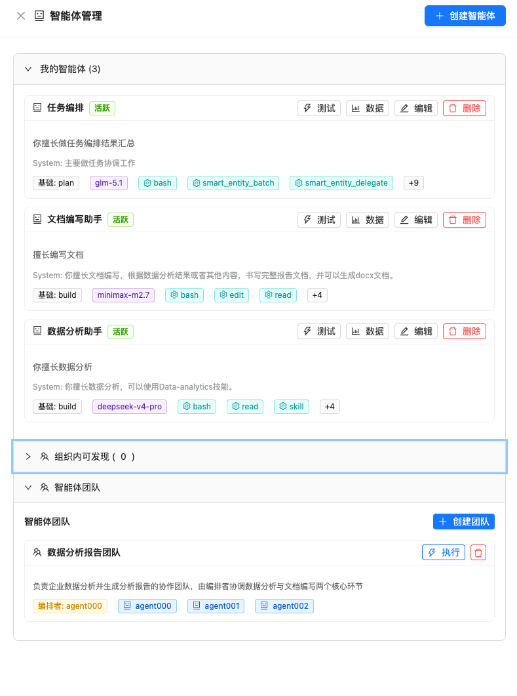

中文 | **[English](README.md)**

# OpenHub

> 基于 [opencode](https://opencode.ai) 构建的企业级多用户 AI 平台。智能体团队、飞书集成、跨会话记忆、完整版本控制。

[](https://www.python.org/downloads/)
[](https://nodejs.org/)
[](https://fastapi.tiangolo.com/)
[](https://reactjs.org/)
[](https://opencode.ai)

---

## 核心亮点

**智能体团队协作** — 创建具有特定能力的 AI 智能体，组建团队协作处理复杂多步骤任务。编排者自动分发子任务、收集结果、汇总答案。支持自然语言自动组队：描述你的需求，系统自动匹配最佳智能体、组建团队。

**飞书集成** — 飞书双向实时消息，支持渠道级模型配置、会话复用，对话记录与网页端统一管理。可扩展适配器架构，支持企业微信/钉钉接入。

**多用户平台** — 单个 opencode 实例，用户隔离工作空间。跨会话记忆、Agentic 知识库（BM25+TF-IDF，无需向量数据库）、Git 时光机、定时任务、自学习引擎、24+ 模块化技能包、模型兜底链、移动端适配。

---

## 系统架构

```
 前端 (:8000)  ──▶  后端 (:8000)  ──▶  opencode serve (:4096)
                                        ┌──── ?directory= ────┐
                                        │                      │
                               workspace/admin/       workspace/alice/
                               ├── .opencode/         ├── .opencode/
                               │   ├── skills/        │   ├── skills/
                               │   └── tools/         │   └── tools/
                               ├── MEMORY.md          ├── MEMORY.md
                               └── (git 仓库)         └── (git 仓库)

 MySQL ─ users · sessions · messages · permissions · smart_entities · smart_entity_teams
          knowledge_bases · git_snapshots · tasks · channels
```

---

## 智能体协作

### 单智能体委派

创建具有特定能力的智能体，通过自然语言委派任务：

```
 "让 agent001 分析 2025 年收款情况"
         ↓
 smart_entity_delegate → 任务存入 MySQL
         ↓
 自动接受 → 在目标工作空间创建隔离会话 → 使用智能体记忆上下文执行
         ↓
 轮询直到完成 → 任务中心展示结果
```

### 智能体团队

将多个智能体组成团队。编排者协调成员、分发子任务、汇总结果。

```
 描述需求："分析 2025 年销售数据并生成报告"
         ↓
 LLM 拆解子任务 → 匹配最佳智能体 → 自动组建团队
         ↓
 编排者通过 smart_entity_delegate 向成员分发任务
         ↓
 串行协调：等待成员结果 → 传递给下一个成员
         ↓
 全部完成 → 编排者汇总 → 返回最终结果
```



**核心设计：** 编排者仅使用委派工具（不自行执行）。每个成员在隔离工作空间中运行。自动配置并发限制。僵尸任务自动检测超时。

| 工具 | 说明 |
|------|------|
| `smart_entity_delegate` | 向智能体委派任务 |
| `smart_entity_task_wait` | 等待任务完成 |
| `smart_entity_batch` | 批量委派多个任务 |
| `smart_entity_auto_team` | 从自然语言自动创建团队 |
| `smart_entity_team_execute` | 通过编排者执行团队任务 |

---

## 飞书集成

```
 飞书消息 → 后端回调 → 验证签名
         ↓
 复用/创建 opencode 会话（按用户绑定）
         ↓
 流式 SSE 响应 → 按 message_id 分条发送飞书消息
         ↓
 保存到 conversation_messages（与网页聊天统一）
```

- **渠道级模型配置**（未配置则使用全局默认）
- **会话复用**：同一飞书用户跨消息复用同一会话
- **可扩展**：适配器模式支持企业微信/钉钉

---

## 界面截图

| 对话界面 | 管理后台 | 智能体团队 |
|:-:|:-:|:-:|
|  |  |  |

| 智能体管理 | 协作任务中心 | 跨会话记忆 |
|:-:|:-:|:-:|
|  |  |  |

---

## 更多功能

| 功能 | 说明 |
|------|------|
| **跨会话记忆** | AI 自动将事实/偏好保存到工作空间 `MEMORY.md`/`USER.md`，每次 prompt 自动注入 |
| **Agentic 知识库** | 双层级（企业+用户），BM25+TF-IDF 搜索，中文 n-gram 分词，无需向量数据库 |
| **Git 时光机** | 每轮对话自动提交快照，浏览 diff，一键撤销任意修改 |
| **定时任务** | 通过对话或 UI 创建 cron 定时任务，支持编辑、暂停、恢复、手动触发 |
| **自学习引擎** | 从交互模式自动创建技能包，30 天生命周期，管理员审核 |
| **多用户隔离** | 单 opencode 实例，每用户独立工作空间、技能包、工具、权限 |
| **模型兜底** | 可配置兜底链，Provider 异常时自动切换 |

---

## 快速开始

```bash
# 1. 克隆并配置
git clone <repo-url> && cd OpenHub
cp smart-query-backend/.env.example smart-query-backend/.env

# 2. 安装依赖
cd smart-query-backend && pip install -r requirements.txt
cd ../smart-query-frontend && npm install

# 3. 构建前端
npm run build && cp -r dist ../smart-query-backend/static

# 4. 初始化数据库并启动
cd ../smart-query-backend && python init_db.py
python -m uvicorn app.main:app --host 0.0.0.0 --port 8000
```

访问：**http://localhost:8000** · API 文档：http://localhost:8000/docs

前置要求：Python 3.10+、Node.js 18+、MySQL 5.7+、Redis、[opencode](https://opencode.ai) 1.4+

---

## 项目结构

```
OpenHub/
├── .opencode/
│   ├── skills/                    # 24+ 个技能包
│   └── tools/
│       ├── memory.ts              # 跨会话记忆
│       ├── knowledge.ts           # 知识库工具
│       ├── scheduled-task.ts      # 定时任务
│       └── smart-entity.ts        # 智能体（delegate/wait/batch/team）
├── smart-query-backend/
│   ├── app/api/                   # auth, query, admin, internal, channels, smart_entity
│   ├── app/services/              # stream, memory, knowledge, scheduler, learner, channels
│   ├── workspace/{username}/      # 用户工作空间
│   └── init_db.py
├── smart-query-frontend/
│   └── src/
│       ├── pages/                 # Login, SmartQuery, Admin
│       ├── components/            # ChatInput, TeamManager, AutoTeamModal, KnowledgeManager, ...
│       └── services/api.js
└── AGENTS.md
```

---

## 配置与开发

**后端**（`smart-query-backend/.env`）：

```bash
DB_HOST=127.0.0.1  DB_USER=root  DB_PASSWORD=***  DB_NAME=ANALYSE
OPENCODE_BASE_URL=http://127.0.0.1:4096
JWT_SECRET_KEY=***  INTERNAL_API_SECRET=***
REDIS_HOST=localhost  REDIS_PORT=6379
```

**开发：**

```bash
# 后端（自动重载）
cd smart-query-backend && python -m uvicorn app.main:app --reload --host 0.0.0.0 --port 8000

# 前端（热重载，代理到后端）
cd smart-query-frontend && npm run dev    # :3000

# 构建并部署
cd smart-query-frontend && npm run build && cp -r dist ../smart-query-backend/static
```

> **生产模式**：后端从 `static/` 提供前端构建产物，统一 8000 端口访问，无需单独前端服务器。

---

## 许可证

MIT License
