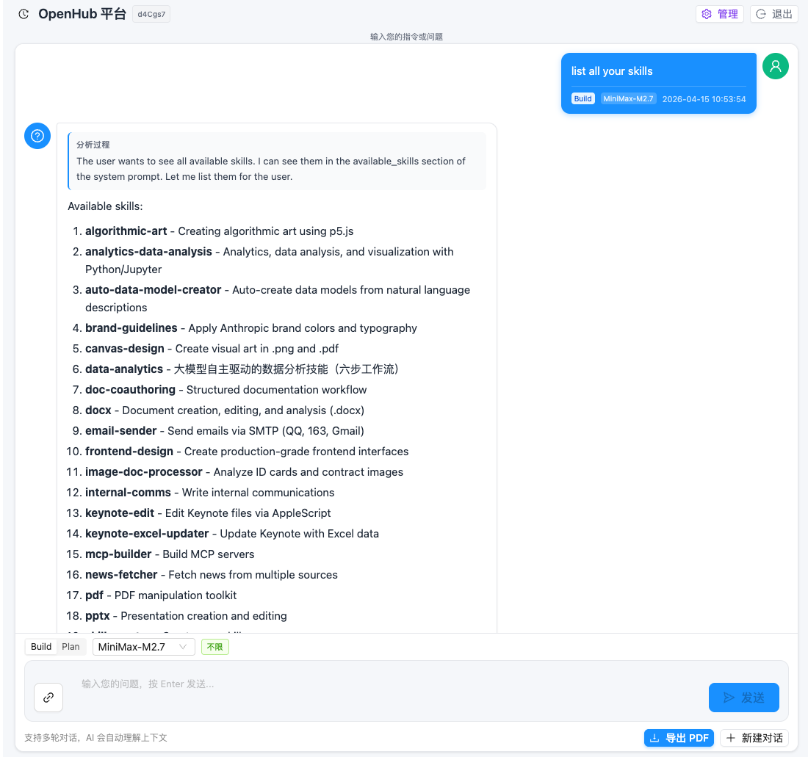
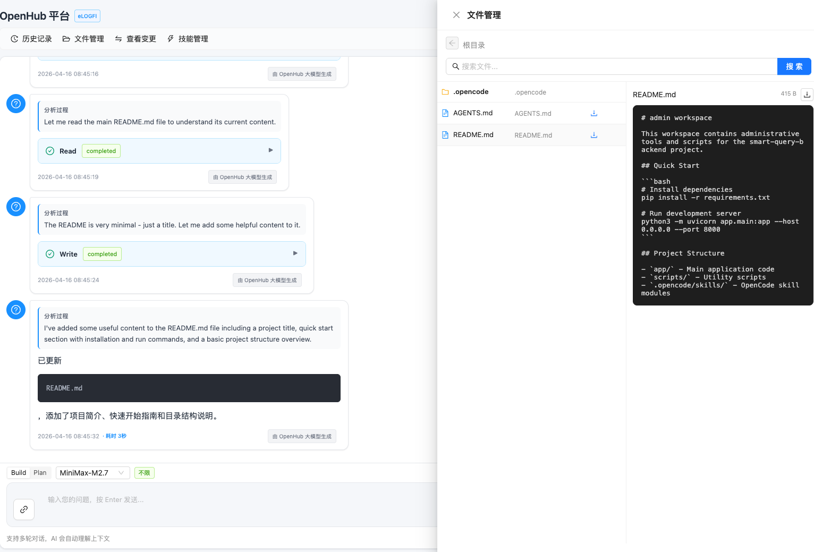
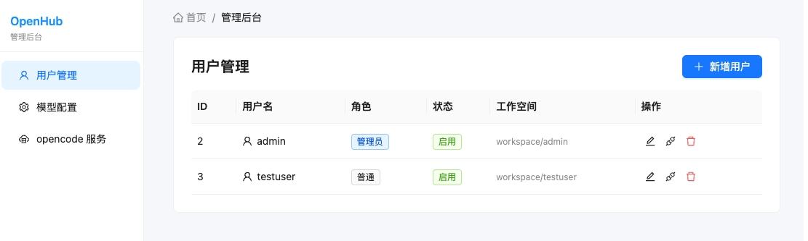
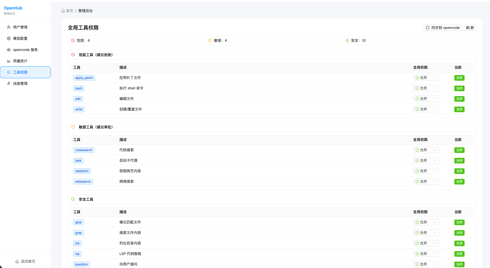
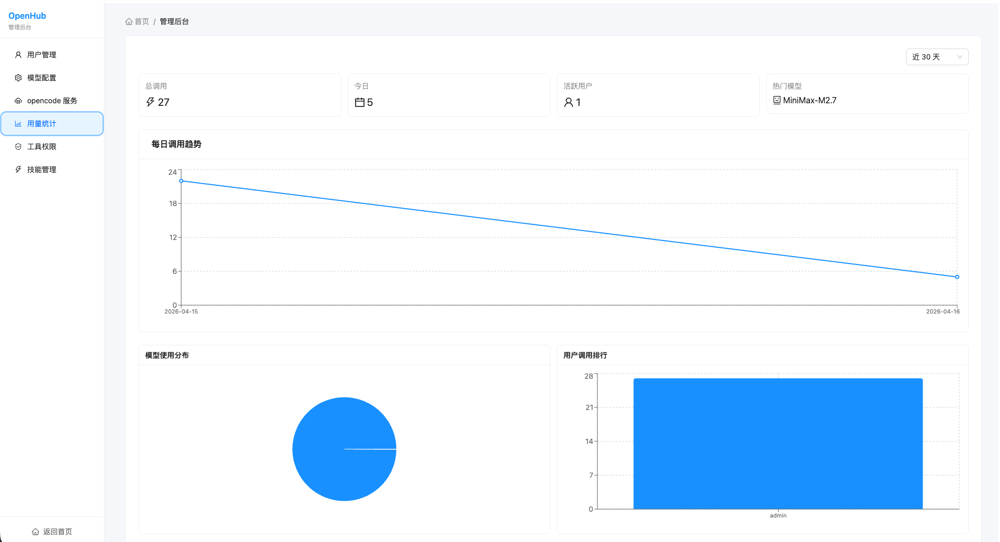
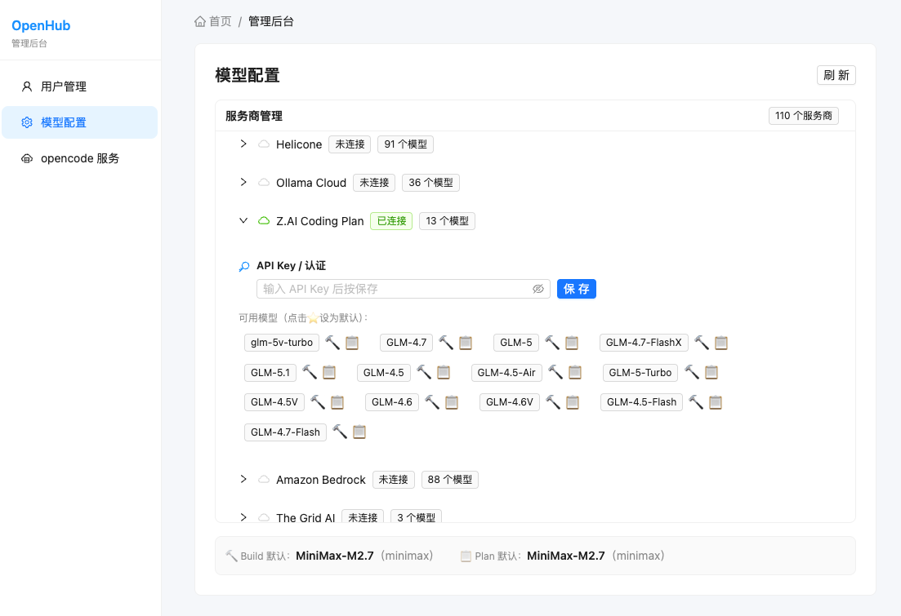
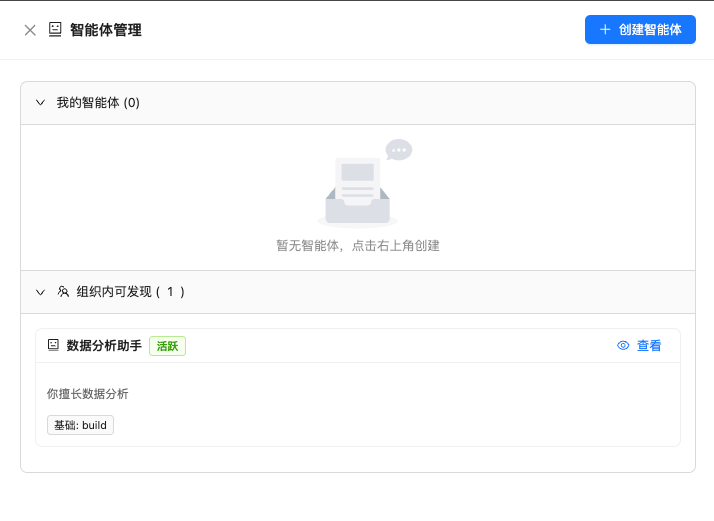
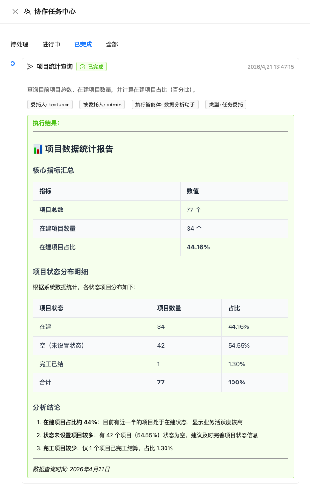
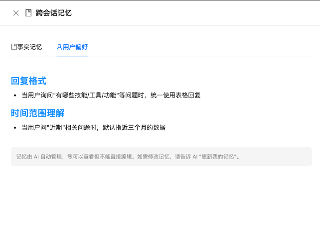

中文 | **[English](README.md)**

# OpenHub

> 基于 [opencode](https://opencode.ai) 构建的企业级多用户 AI 平台。单实例 opencode、用户隔离工作空间、跨会话记忆、完整版本控制。

[](https://www.python.org/downloads/)
[](https://nodejs.org/)
[](https://fastapi.tiangolo.com/)
[](https://reactjs.org/)
[](https://opencode.ai)

---

## 核心亮点

**多用户架构** — 单个 `opencode serve` 实例服务所有用户。每个用户拥有独立工作空间目录，通过 `?directory=` 按会话隔离。独立的技能包、工具、模型权限和用量限制。

**跨会话记忆** — AI 会记住你。自动将项目事实和用户偏好保存为工作空间中的 Markdown 文件。每次新对话时，记忆上下文自动注入 prompt——无需反复说明。

**Agentic 知识库** — 双层级知识体系：企业知识库（全局、管理员维护）+ 用户知识库（私有、按用户隔离）。BM25+TF-IDF 混合搜索引擎，支持中文 n-gram 分词。知识通过 `<context>` 标签自动注入 prompt，上下文不足时 AI 会主动搜索知识库——无需向量数据库。

**Git 时光机** — 每个工作空间都是 git 仓库。每轮对话自动提交快照。用户可以浏览变更、查看 diff、一键撤销任意修改。撤销前自动保存当前状态，不丢失任何内容。

**定时任务** — 通过对话或 UI 创建 cron 定时任务。AI 自动设置调度、按时执行、结果通知用户。支持编辑、暂停、恢复和手动触发。

**智能体协作** — 创建具有特定能力和协作配置的 AI 智能体，通过自然语言在智能体之间委派复杂任务。支持自动接受任务、跟踪执行状态、在任务中心查看格式化结果。支持智能体发现、任务生命周期管理（待处理 → 处理中 → 已完成）和基于角色的权限控制（委托人 / 被委托人 / 执行者）。

**多渠道集成** — 将 AI 连接到聊天平台。当前支持飞书双向实时消息。每个渠道可独立配置默认模型。对话记录统一保存到 `conversation_messages` 表，与网页端共享历史。可扩展适配器架构，支持企业微信/钉钉接入。

**自学习引擎** — AI 从用户交互中学习。当工具使用次数超过阈值时，系统通过 LLM 分析自动从成功模式中创建技能包。技能拥有完整生命周期：自动创建 → 30 天过期 → 90 天归档，支持管理员审核接受/拒绝。

---

## 系统架构

```
 前端 + API (:8000)  ──▶  后端 (:8000)  ──▶  opencode serve (:4096)
                                             ┌──── ?directory= ────┐
                                             │                      │
                                    workspace/admin/       workspace/alice/
                                    ├── .opencode/         ├── .opencode/
                                    │   ├── skills/        │   ├── skills/
                                    │   └── tools/         │   └── tools/
                                    ├── MEMORY.md          ├── MEMORY.md
                                    ├── USER.md            ├── USER.md
                                    └── (git 仓库)         └── (git 仓库)

 MySQL ─ users · sessions · messages · permissions · usage · git_snapshots · tasks
         knowledge_bases · knowledge_sources
```

核心设计：后端代理所有请求到同一个 opencode 实例，通过 `?directory={workspace_path}` 隔离用户。每个工作空间拥有独立的技能、工具、记忆文件和 git 历史。

 此外还支持：模型兜底链、定时任务（cron）、智能体协作、Agentic 知识库、多渠道集成、自学习引擎、SSE 流式响应、工具权限管理、文件浏览器、移动端适配、24+ 模块化技能包。

---

## 跨会话记忆

```
 用户对话 → AI 判断信息值得记住
                  ↓
           memory_save 工具（opencode 自定义工具）
                  ↓
      写入工作空间的 MEMORY.md 或 USER.md
                  ↓
 build_memory_context() 在下次 prompt 时读取文件
                  ↓
      记忆上下文自动拼接到用户问题前（无需手动操作）
```

| 文件 | 类型 | AI 记住什么 |
|------|------|-------------|
| `MEMORY.md` | 事实记忆 | 项目背景、工作进展、技术决策、代码库结构 |
| `USER.md` | 用户偏好 | 沟通风格、语言习惯、工作方式偏好 |

- **存储**：用户工作空间内的 Markdown 文件——兼容 git，人类可读
- **写入**：AI 通过 opencode 自定义工具 `memory_save` 主动保存（`.opencode/tools/memory.ts`）
- **读取**：每次 prompt 通过 `build_memory_context()` 自动注入（上限 2000 字符）
- **定时任务**：任务的 prompt 也会自动注入记忆上下文
- **前端**：只读查看器（Drawer），管理员可按用户开启/关闭记忆工具

---

## Agentic 知识库

```
  ┌─────────────────────────────────────────────────────────┐
  │                    用户发送问题                            │
  └─────────────┬───────────────────────────┬───────────────┘
                ↓                           ↓
     ┌──────────────────┐        ┌──────────────────────┐
     │   用户知识库       │        │    企业知识库          │
     │ （按用户，MySQL）   │        │  （全局，MySQL）       │
     └────────┬─────────┘        └──────────┬───────────┘
              ↓                              ↓
     小知识库 → 全量注入              始终 → BM25+TF-IDF 搜索
     大知识库 → 搜索检索              最多 1 条结果，每条 400 字
              ↓                              ↓
     ┌──────────────────────────────────────────────────────┐
     │  build_knowledge_context() → <context> XML 注入       │
     │  总量上限 1200 字符 + 主动搜索提示                      │
     └──────────────────────┬───────────────────────────────┘
                            ↓
     ┌──────────────────────────────────────────────────────┐
     │  AI 检查上下文 → 足够？→ 直接回答                       │
     │                  不足？→ 主动调用                       │
     │                  knowledge_knowledge_search          │
     └──────────────────────────────────────────────────────┘
```

### 双层级架构

| 层级 | 范围 | 管理方式 | 存储 |
|------|------|---------|------|
| **用户知识库** | 私有，按用户隔离 | 用户通过 Drawer UI 自助管理 | MySQL `knowledge_sources` 表 |
| **企业知识库** | 全局，所有用户可用 | 管理员通过管理后台统一管理 | MySQL + `enterprise-knowledge/` 目录 |

### 注入策略

| 条件 | 用户知识库 | 企业知识库 |
|------|-----------|-----------|
| 用户知识库 ≤ 1500 字符 | 全量注入 | 搜索检索（最多 1 条） |
| 用户知识库 > 1500 字符 | 搜索检索（最多 2 条） | 搜索检索（最多 1 条） |
| 总量限制 | 1200 字符，每条来源 400 字 | 同左 |

知识内容以 `<context>` XML 标签包装，与用户实际问题分开。末尾附加提示：*"如果上下文信息不足以回答用户问题，请主动搜索知识库。"*

### 搜索引擎

- **算法**：BM25（权重 0.7）+ TF-IDF（权重 0.3）混合排序
- **分词**：中文 unigram/bigram/trigram + 空格分词
- **流程**：MySQL LIKE 预筛选 → Python BM25 重排序
- **无需向量数据库** —— 纯数据库 + 算法搜索

### 文档处理

| 格式 | 解析器 | 分块策略 |
|------|--------|---------|
| Markdown | 原生解析 | 按标题层级分割（##/### 边界） |
| TXT | 纯文本 | 滑动窗口（300 字符，50 字符重叠） |
| PDF | PyPDF2 | 按页分割 + 滑动窗口 |
| DOCX | python-docx | 按段落分割 |
| XLSX/CSV | openpyxl/pandas | 按行批量分块 |

### MCP 工具

| 工具 | 说明 |
|------|------|
| `knowledge_knowledge_search` | 搜索知识库，附主动搜索使用提示 |
| `knowledge_knowledge_list` | 列出所有可用知识源 |
| `knowledge_knowledge_info` | 获取知识库概览和统计信息 |
| `knowledge_knowledge_save` | AI 主动保存重要信息到知识库 |

### 前端

- **用户 Drawer**（`KnowledgeManager.jsx`）：3 个 Tab — 知识列表、统计信息、企业知识库（只读）
- **管理后台**（`AdminPage.jsx`）：企业知识库增删改、文档上传、知识源管理

---

## Git 时光机

```
 对话回合结束
       ↓
 自动 git add + commit（仅在文件有变更时）
       ↓
 git_snapshots 表记录 commit hash、会话、diff 摘要
       ↓
 用户打开时光机 → 浏览快照、查看 diff
       ↓
 点击「撤销此修改」→ git checkout {hash}^ → 文件回到修改前状态
       ↓
 自动保存当前状态为新 commit（不丢失数据）
```

- 工作空间创建时自动初始化为 git 仓库
- 每轮对话和定时任务完成后自动创建快照
- **「撤销」恢复到父 commit**——工作空间回到该修改之前的状态
- 初始快照（工作空间初始化）无法撤销，按钮自动禁用
- 支持撤销全部文件或单个文件
- 撤销前自动保存当前状态（不丢失任何内容）

---

## 智能体协作

```
 用户创建智能体（agent），设置名称、描述和能力
                    ↓
 智能体注册协作配置（自动接受、超时时间、权限）
                    ↓
 用户通过对话委派任务："让 agent001 分析 2025 年收款情况"
                    ↓
 smart_entity_delegate 工具创建任务 → 存入 MySQL
                    ↓
 自动接受？→ 在目标工作空间创建会话 → 使用智能体上下文执行
                    ↓
 每 30 秒轮询会话直到 finish=stop → 保存结果
                    ↓
 任务中心显示：委托人 / 被委托人 / 执行者 / 带 markdown 的结果
```

| 字段 | 说明 |
|------|------|
| **委托人** | 创建并发送任务的用户 |
| **被委托人** | 接收任务的用户（目标智能体的所有者） |
| **执行者** | 实际执行任务的智能体 |
| **状态** | 待处理 → 已接受 → 处理中 → 已完成 / 失败 |

- 智能体可根据协作配置自动接受任务
- 任务执行在目标工作空间创建隔离会话，使用智能体记忆上下文
- 结果支持 Markdown 表格和 GFM 语法格式化
- 任务中心 UI 支持基于角色的筛选，完整展示任务生命周期

---

## 快速开始

```bash
# 1. 克隆并配置
git clone <repo-url> && cd OpenHub
cp smart-query-backend/.env.example smart-query-backend/.env   # 填入 MySQL 凭据、JWT 密钥

# 2. 安装依赖
cd smart-query-backend && pip install -r requirements.txt
cd ../smart-query-frontend && npm install

# 3. 构建前端
npm run build
cp -r dist ../smart-query-backend/static

# 4. 初始化数据库
cd ../smart-query-backend && python init_db.py

# 5. 启动（单端口，后端直接提供前端页面）
python -m uvicorn app.main:app --host 0.0.0.0 --port 8000
```

访问：**http://localhost:8000**（前端 + API）· **API 文档** http://localhost:8000/docs

前置要求：Python 3.10+、Node.js 18+、MySQL 5.7+、Redis、[opencode](https://opencode.ai) 1.4+

---

## 界面截图

| 对话界面 | 文件管理 | 管理后台 |
|:-:|:-:|:-:|
|  |  |  |

| 工具权限 | 用量统计 | 模型设置 |
|:-:|:-:|:-:|
|  |  |  |

| 智能体管理 | 协作任务中心 | 跨会话记忆 |
|:-:|:-:|:-:|
|  |  |  |

---

## 多渠道集成

```
  飞书用户发送消息
          ↓
  飞书事件 → 后端回调 (/api/channels/{id}/callback)
          ↓
  Dispatcher 验证签名、解析消息
          ↓
  复用或创建 opencode 会话（按用户绑定）
          ↓
  发送 prompt 到 opencode → 流式接收 SSE 响应
          ↓
  每个 message_id 完成时 → 发送飞书消息
          ↓
  保存到 conversation_messages（与网页聊天统一）
          + channel_messages（审计日志）
```

### 架构组件

| 组件 | 职责 |
|------|------|
| `channels/base.py` | 抽象 `ChannelAdapter` + `ChannelMessage` 数据类 |
| `channels/feishu.py` | 飞书适配器：Token 管理、签名验证、消息解析/发送 |
| `channels/dispatcher.py` | 流式处理器：会话复用、按 message_id 分条投递、对话持久化 |
| `api/channels.py` | REST API：渠道增删改、回调端点、连接测试 |

### 功能特性

- **渠道级模型配置**：每个渠道可独立设置默认模型（未配置则使用全局默认）
- **会话复用**：同一飞书用户跨消息复用同一 opencode 会话
- **消息持久化**：对话保存到 `conversation_messages` 表，使用 opencode session_id 关联
- **可扩展**：适配器模式支持添加企业微信/钉钉渠道

### 数据库表

| 表 | 用途 |
|----|------|
| `channels` | 渠道配置（类型、名称、含模型/App 凭据的 JSON 配置） |
| `channel_bindings` | 用户 ↔ 渠道绑定（external_user_id → opencode session_id） |
| `channel_messages` | 入站/出站消息审计日志 |

---

## 自学习引擎

```
  用户与 AI 交互（工具调用发生）
          ↓
  stream.py 统计每轮工具使用次数
          ↓
  工具调用 ≥ 3 次？→ 触发分析
          ↓
  learner.py 将上下文发送给 LLM 分析
          ↓
  LLM 判断：创建技能包？更新已有技能？
          ↓
  在工作空间 .opencode/skills/ 中创建技能文件
          ↓
  记忆更新，记录新模式
          ↓
  前端弹出通知：用户可接受/拒绝
```

### 技能包生命周期

| 阶段 | 时长 | 说明 |
|------|------|------|
| 活跃 | 0–30 天 | 新创建的技能包，正在使用 |
| 过期 | 30 天 | 标记为待审核，未使用则自动删除 |
| 归档 | 90 天 | 移至归档，不再激活 |

### 配置项（system_config 表）

| 键 | 说明 |
|----|------|
| `learning_enabled` | 启用/禁用自学习 |
| `learning_model` | 用于模式分析的模型 |
| `learning_provider` | 分析模型的提供商 |
| `learning_api_key` | 分析模型的 API 密钥 |
| `learning_api_base` | 分析模型的 API 基础 URL |

---

## 项目结构

```
OpenHub/
├── .opencode/
│   ├── skills/                    # 24+ 个技能包（模板源）
│   └── tools/
│       ├── memory.ts              # 跨会话记忆工具
│       ├── knowledge.ts           # 知识库工具（search/list/info/save）
│       └── scheduled-task.ts      # 定时任务工具
├── smart-query-backend/           # FastAPI 后端
│   ├── app/
│   │   ├── api/                   # auth, query, admin, session, internal, knowledge, admin_knowledge, channels
│   │   ├── services/              # stream, memory, git_snapshot, failover, scheduler, learner, curator
│   │   ├── services/channels/     # base, feishu, dispatcher（多渠道集成）
│   │   ├── services/knowledge/    # parser, chunker, search (BM25+TF-IDF), injector
│   │   └── core/                  # JWT 认证
│   ├── enterprise-knowledge/      # 企业知识库存储目录
│   ├── workspace/{username}/      # 用户工作空间
│   └── init_db.py
├── smart-query-frontend/          # React + Vite + Ant Design
│   └── src/
│       ├── pages/                 # LoginPage, SmartQueryPage, AdminPage
│       ├── components/            # ChatInput, MemoryViewer, KnowledgeManager, GitTimeMachine, ChannelSettingsPage, ...
│       └── services/api.js
└── AGENTS.md
```

---

## 配置

**后端**（`smart-query-backend/.env`）：

```bash
DB_HOST=127.0.0.1    DB_USER=root    DB_PASSWORD=***    DB_NAME=ANALYSE
OPENCODE_BASE_URL=http://127.0.0.1:4096
OPENCODE_USERNAME=opencode    OPENCODE_PASSWORD=***
JWT_SECRET_KEY=***
REDIS_HOST=localhost    REDIS_PORT=6379    REDIS_DB=0
INTERNAL_API_SECRET=***    # 记忆和任务工具必需
```

**管理后台**（`/admin`）：用户增删改、工作空间初始化、按用户配置模型/工具/技能权限、模型兜底链、opencode 服务管理。

---

## 开发

```bash
# 后端（自动重载）
cd smart-query-backend && python -m uvicorn app.main:app --reload --host 0.0.0.0 --port 8000

# 前端开发（热重载，代理到后端）
cd smart-query-frontend && npm run dev      # 开发服务器 :3000

# 构建并部署前端到后端静态目录
cd smart-query-frontend && npm run build && cp -r dist ../smart-query-backend/static

# 数据库迁移
python init_db.py
```

> **生产模式**：后端从 `smart-query-backend/static/` 提供前端构建产物，统一在 8000 端口访问，无需单独的前端服务器。
> **开发模式**：运行 `npm run dev` 启动热重载前端（端口 3000），API 请求代理到后端 8000 端口。

---

## 许可证

MIT License
